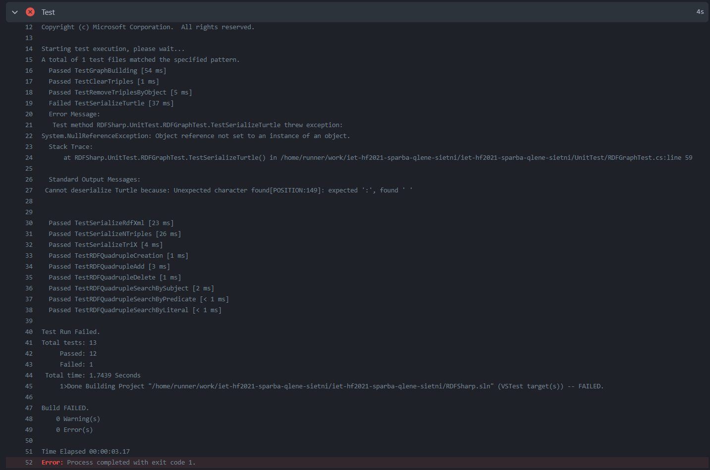

# 5. feladat: Unit tesztek

Ebben a feladatban egységteszteket készítettünk, amikkel a kód **11%**-át fedtük le. A **coverage** azért ilyen kevés, mert csupán a fontosabb függvényeket teszteltük le, amelyeket egy felhasználó nagy valószínűséggel használna (ezek találhatók ezen [library dokumentációjában](https://github.com/mdesalvo/RDFSharp/releases/download/v2.22.0/RDFSharp-2.22.0.pdf)).

A mi tesztjeinknek a célja az volt, hogy leteszteljük, ezen függvények ugyanúgy működnek-e, mint ahogy az a fentebb említett dokumentációban le van írva, illetve hogy lehet-e ezeket továbbfejleszteni, esetleg javítani.

Az egységtesztek a UnitTest mappában találhatók meg. Az alábbiakban ismertetjük, mit is vizsgáltunk egyes teszteknél:

## RDFStoreTest

**Kontextus**ban **subject**-ekhez kapcsolunk **object**-eket, és az ezekhez tartozó metódusokat teszteljük le. Például:
- `TestRDFQuadrupleAdd`: a teszt szerint sikeresen hozzá lehet adni RDF-négyeseket (**RDFQuadruple**) **MemoryStore**-hoz, amik egyfajta gráfként funkcionálnak.
- `TestRDFQuadrupleClear`: a teszt szerint sikeresen kitörli az összes tagot a "gráfból".
- `TestRDFQuadrupleSearchByLiteral`: a teszttel azt néztük meg, hogy lehet-e keresni az **RDFMemoryStore**-ban konkrét szöveges tulajdonság alapján. Ennél a tesztnél arra lettünk figyelmesek, hogy ez a funkció nem teljesen úgy működik, ahogy kellene. Amikor egy **RDFPlainLiteral**-t létrehozunk, akkor azt tehetjük úgy is, hogy melléírjuk, hogy maga a szöveg milyen nyelven van. A hiba az, hogy ha a keresésnél nem írjuk oda a text nyelvét, akkor nem fogunk egyezést találni.

## RDFQueryTest

Ebben a tesztben 10 darab kutyát és tulajdonost hoztunk létre egy gráfban, illetve összekötöttük őket. Ezt követően lekérdeztük azt a kutyát, akinek a gazdájának a nevében szerepel a "7"-es szám. A teszt gond nélkül lefutott.

## RDFGraphTest

Az **RDFGraph** osztály metódusait teszteltük:
- `TestGraphBuilding`: egy **RDFGraph**-hoz **RDFTriple**-ket adunk, majd megvizsgáljuk, hogy ugyanannyi triple található-e benne.
-  `TestClearTriples`: egy **RDFGraph**-hoz **RDFTriple**-ket adunk, majd töröljük azokat belőle. Ezt követően megvizsgáljuk, hogy 0 triple található-e benne.
- `TestRemoveTriplesByObject`: egy **RDFGraph**-hoz **RDFTriple**-ket adunk. Ezután kiválasztunk egy object-et és megnézzük, valóban 5 darab triple-ben fordul-e elő, ezt követően kitöröljük őket és azt ellenőrizzük, tényleg 95 darab triple maradt-e a gráfban. Végül azt teszteljük, hogy az adott object nem fordul elő egyik triple-ben sem a gráfban.
- `TestSerializeTurtle`, `TestSerializeRdfXml`, `TestSerializeNTriples`, `TestSerializeTriX`: egy **RDFGraph**-hoz **RDFTriple**-ket adunk, majd az adott **RDFFormat**-ba szerializálunk, elmentjük külön-külön szöveges fájlba. Ezt követően ezt a fájlt deszerializáljuk, majd összehasonlítjuk az eredeti gráfnak és ennek a folyamatnak az eredményét.

A `TestSerializeTurtle` metódus esetében kisebb hibába ütköztünk. Lokálisan sikeresen lefutott az erre a függvényre vonatkozó teszt, azonban a **GitHub Actions**-ben való build-eléskor az alábbi hibaüzenetet kaptuk:

Mivel mind a négy format-ba történő szerializációt és deszerialzációt nagyon hasonlóan valósítjuk meg és csak ebben az egyetlen egy tesztesetben okozott hibát, ezért betudtuk ezt, mint a GitHub Actions egy bug-ja.